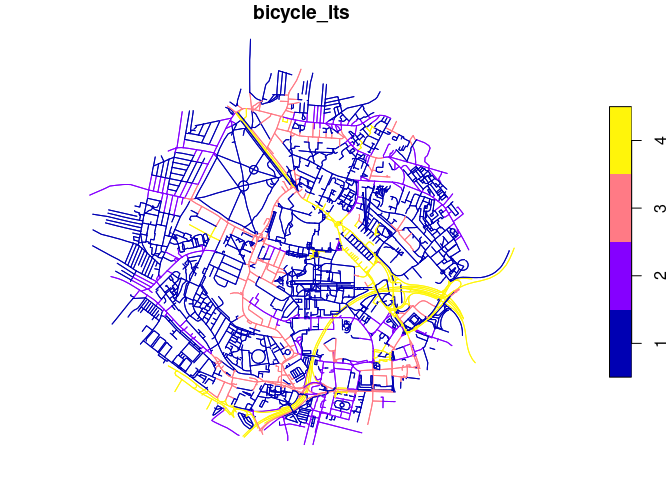
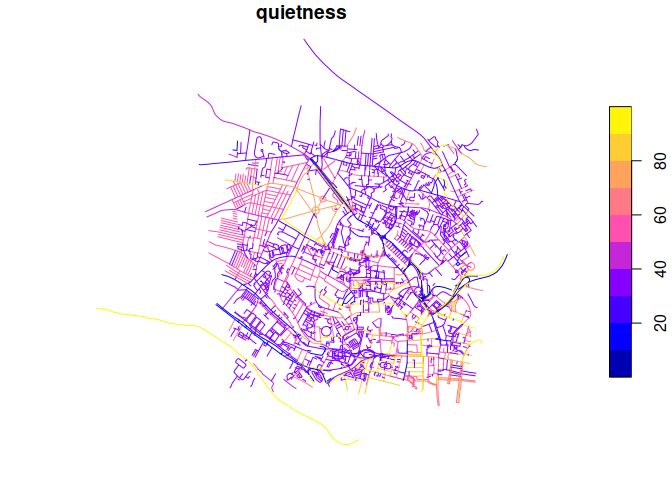

<!-- README.md is generated from README.Rmd. Please edit that file -->

# cyclability

<!-- badges: start -->
<!-- badges: end -->

The goal of cyclability is to generate estimates of broadly defined
cyclability. There are at least three definitions of how conducive to
cycling different places and segments of roads and travel networks are:

- Level of Traffic Stress (LTS)
- [Bikeability](https://www.britishcycling.org.uk/cycletraining/article/ct20110111-cycletraining-What-is-Bikeability-0)
  levels, which rates infrastructure based on the level of training
  needed to feel comfortable:
  - Level 1 teaches basic bike-handling skills in a controlled
    traffic-free environment.
  - Level 2 teaches trainees to cycle planned routes on minor roads,
    offering a real cycling experience.
  - Level 3 ensures trainees are able to manage a variety of traffic
    conditions and is delivered on busier roads with advanced features
    and layouts
- CycleStreets’s [Quietness
  rating](https://www.cyclestreets.net/help/journey/howitworks/#quietness)
  from 1 (very unpleasant for cycling) to 100 (the quietest)

# Setup

For this practical we’ll be using a number of R packages, which can be
installed as follows:

``` r
# core packages:
install.packages("remotes")
core_packages = c(
  "tidyverse",
  "sf",
  "tmap"
)
remotes::install_cran(core_packages)
```

Other packages that we use which you may want to install include:

``` r
other_packages = c(
  "r5r"
)
remotes::install_cran(other_packages)
#> Skipping install of 'r5r' from a cran remote, the SHA1 (0.7.1) has not changed since last install.
#>   Use `force = TRUE` to force installation
remotes::install_github("cyclestreets/cyclestreets-r")
#> Skipping install of 'cyclestreets' from a github remote, the SHA1 (68b345cd) has not changed since last install.
#>   Use `force = TRUE` to force installation
```

For the practical we assume you have the following packages loaded:

``` r
library(tidyverse)
library(sf)
```

To get going with the data a good starting point is to download the the
data in this repo. Do this by clicking on
<https://github.com/ITSLeeds/cyclability/archive/refs/heads/main.zip>
and then download and unzip the folder. Assuming you have unzipped the
folder in your Downloads folder you should be able to open the project
with the following command in RStudio:

``` r
rstudioapi::openProject("~/Downloads/cyclability-main/")
```

After you have opened the project you should be able to run the
following commands. Try reproducing the next code chunk to generate a
plot to see if it works. If not you can open an issue at
<https://github.com/ITSLeeds/cyclability/issues>

# Cyclability data

## LTS data from R5

To get estimates of LTS on the network we used the R5 routing engine via
the `r5r` package. See [code/r5r_setup.R](code/r5r_setup.R) for details.

The resulting estimates of LTS in Leeds can be read-in and visualised as
follows:

``` r
leeds_lts = readRDS("r5r/r5r_lts_shp_osmtags.Rds")
leeds_lts
#> Simple feature collection with 10134 features and 19 fields (with 312 geometries empty)
#> Geometry type: LINESTRING
#> Dimension:     XY
#> Bounding box:  xmin: -1.575111 ymin: 53.79672 xmax: -1.53612 ymax: 53.81871
#> Geodetic CRS:  WGS 84
#> First 10 features:
#>    edge_index  osm_id from_vertex to_vertex street_class length walk  car
#> 1           0 1709456           0         1     TERTIARY 14.750 TRUE TRUE
#> 2           1 1709456           1         0     TERTIARY 14.750 TRUE TRUE
#> 3           2 1709456           1         2     TERTIARY 44.502 TRUE TRUE
#> 4           3 1709456           2         1     TERTIARY 44.502 TRUE TRUE
#> 5           4 1709456           2         3     TERTIARY 19.366 TRUE TRUE
#> 6           5 1709456           3         2     TERTIARY 19.366 TRUE TRUE
#> 7           6 1709456           3         4     TERTIARY 45.043 TRUE TRUE
#> 8           7 1709456           4         3     TERTIARY 45.043 TRUE TRUE
#> 9           8 1709460           5         6        OTHER 69.640 TRUE TRUE
#> 10          9 1709460           6         5        OTHER 69.640 TRUE TRUE
#>    car_speed bicycle bicycle_lts        name     highway waterway aerialway
#> 1     48.276    TRUE           3 Hanover Way    tertiary     <NA>      <NA>
#> 2     48.276    TRUE           3 Hanover Way    tertiary     <NA>      <NA>
#> 3     48.276    TRUE           3 Hanover Way    tertiary     <NA>      <NA>
#> 4     48.276    TRUE           3 Hanover Way    tertiary     <NA>      <NA>
#> 5     48.276    TRUE           3 Hanover Way    tertiary     <NA>      <NA>
#> 6     48.276    TRUE           3 Hanover Way    tertiary     <NA>      <NA>
#> 7     48.276    TRUE           3 Hanover Way    tertiary     <NA>      <NA>
#> 8     48.276    TRUE           3 Hanover Way    tertiary     <NA>      <NA>
#> 9     32.184    TRUE           3  Hyde Place residential     <NA>      <NA>
#> 10    32.184    TRUE           3  Hyde Place residential     <NA>      <NA>
#>    barrier man_made z_order                        other_tags
#> 1     <NA>     <NA>       4 "lit"=>"yes","maxspeed"=>"30 mph"
#> 2     <NA>     <NA>       4 "lit"=>"yes","maxspeed"=>"30 mph"
#> 3     <NA>     <NA>       4 "lit"=>"yes","maxspeed"=>"30 mph"
#> 4     <NA>     <NA>       4 "lit"=>"yes","maxspeed"=>"30 mph"
#> 5     <NA>     <NA>       4 "lit"=>"yes","maxspeed"=>"30 mph"
#> 6     <NA>     <NA>       4 "lit"=>"yes","maxspeed"=>"30 mph"
#> 7     <NA>     <NA>       4 "lit"=>"yes","maxspeed"=>"30 mph"
#> 8     <NA>     <NA>       4 "lit"=>"yes","maxspeed"=>"30 mph"
#> 9     <NA>     <NA>       3              "maxspeed"=>"20 mph"
#> 10    <NA>     <NA>       3              "maxspeed"=>"20 mph"
#>                          geometry
#> 1  LINESTRING (-1.55754 53.799...
#> 2  LINESTRING (-1.55754 53.799...
#> 3  LINESTRING (-1.55754 53.799...
#> 4  LINESTRING (-1.55754 53.799...
#> 5  LINESTRING (-1.55754 53.799...
#> 6  LINESTRING (-1.55754 53.799...
#> 7  LINESTRING (-1.55754 53.799...
#> 8  LINESTRING (-1.55754 53.799...
#> 9  LINESTRING (-1.558721 53.80...
#> 10 LINESTRING (-1.558721 53.80...
leeds_lts |> 
  select(bicycle_lts) |> 
  plot()
```

<!-- -->

``` r
leeds_lts |> 
  select(bicycle_lts) |> 
  mapview::mapview(zcol = "bicycle_lts")
```

## Quitness data from CycleStreets

To get estimates of quietness on the network we used `cyclestreets`
package. See [code/cyclestreets_setup.R](code/r5r_setup.R) for details.

The resulting estimates of LTS in Leeds can be read-in and visualised as
follows:

``` r
leeds_quietness = sf::read_sf("cyclestreets/leeds_quietness.geojson")
leeds_quietness
#> Simple feature collection with 2745 features and 9 fields
#> Geometry type: LINESTRING
#> Dimension:     XY
#> Bounding box:  xmin: -1.58941 ymin: 53.79281 xmax: -1.53612 ymax: 53.82387
#> Geodetic CRS:  WGS 84
#> # A tibble: 2,745 × 10
#>    name               ridin…¹     id cycla…² quiet…³ speed…⁴ speed…⁵ pause color
#>    <chr>              <chr>    <int> <chr>     <int>   <int>   <int> <int> <chr>
#>  1 Hanover Way        Minor … 1.71e6 Yes          40      16      26     0 #929…
#>  2 Hyde Place         Reside… 1.71e6 Yes          60      15      24     0 #B06…
#>  3 Buckingham Avenue  Reside… 2.96e6 Yes          40      15      24     0 #929…
#>  4 Back Buckingham M… Servic… 2.96e6 Yes          40      12      20     0 #929…
#>  5 Back Midland Road  Reside… 3.98e6 Yes          60      15      24     0 #B06…
#>  6 Midland Passage    Servic… 3.98e6 Yes          60      12      20     0 #B06…
#>  7 Ebberston Place    Reside… 3.98e6 Yes          60      15      24     0 #B06…
#>  8 Chestnut Place     Reside… 3.98e6 Yes          50       7      12     0 #7E9…
#>  9 Chestnut Place     Reside… 3.98e6 Yes          50       7      12     0 #7E9…
#> 10 Welton Mount       Reside… 3.98e6 Yes          60      15      24     0 #B06…
#> # … with 2,735 more rows, 1 more variable: geometry <LINESTRING [°]>, and
#> #   abbreviated variable names ¹​ridingSurface, ²​cyclableText, ³​quietness,
#> #   ⁴​speedMph, ⁵​speedKmph
leeds_quietness |> 
  select(quietness) |> 
  plot()
```

<!-- -->

``` r
leeds_quietness |> 
  select(quietness) |> 
  mapview::mapview(zcol = "quietness")
```

## Comparison of cyclability metrics

``` r
# task for the hackathon
```

# OSM data

# Estimating cyclability with OSM

The purpose of the hackathon!
